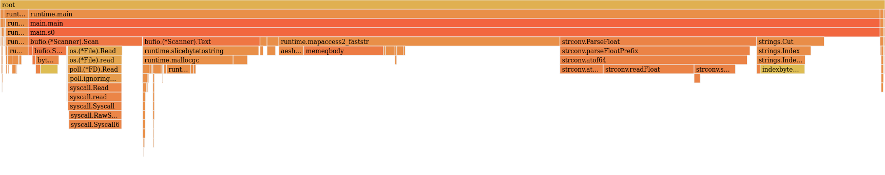
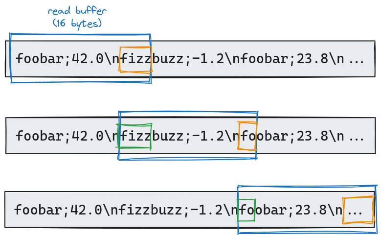

Oops, I did it again! I stumbled into another coding challenge - this time, the [One Billion Rows Challenge](https://www.morling.dev/blog/one-billion-row-challenge/) (proposed by [Gunnar Morling](https://www.morling.dev/)). Instead of initially joining the "who can code the fastest" Olympics, I had a wild thought. What if I took the coding equivalent of a tortoise (in Golang) and tried to turn it into a... slightly faster tortoise?

## What is the One Billion Rows Challenge?
The [One Billion Rows Challenge](https://www.morling.dev/blog/one-billion-row-challenge/) (1BRC) is a data processing task designed to test a program's ability to handle massive amounts of data efficiently. The goal is to read a text file containing one billion lines of temperature data from various weather stations and generate a summary report with the minimum, mean, and maximum temperatures for each station.

The input is a text file with the following format: `<station name>;<temperature>`. Here are a few lines of example input:

```
Buadiposo-Buntong;-40.5
Elgin;-30.2
Vöcklabruck;52.8
Leganés;64.4
Hamminkeln;-18.2
San Lawrenz;-12.0
Streatham;96.8
Karlshamn;-62.4
Embu-Guaçu;-72.4
Haltom City;95.8
```

The output should display the minimum, mean, and maximum temperatures recorded. Here is an example:

```
{Bulawayo:8.9/8.9/8.9, Cracow:12.6/12.6/12.6, Hamburg:12.0/12.0/12.0, Palembang:38.8/38.8/38.8, St. John's:15.2/15.2/15.2, ...}
```

The challenge is very easy to understand and to process. The catch is obviously the size of the input file: one billion rows. To put that in perspective, that is about 15GB of data on my machine. I always loved this kind of challenge, where I'm given a problem and I have to dig deep to find a solution. As I was late to the party, I already knew that the key challenges were about the I/O operations, parsing of the input, memory management, data structures, and parallel processing. That is why I wanted to approach it from a different angle.

## Eroom-Nitot's Law
In early June 2024, I had the opportunity to attend [Devfest Lille](https://devfest.gdglille.org/) and I really enjoyed Tristan Nitot's talk.




Tristan Nitot is a renowned figure in the tech: he co-founded and served as the President of Mozilla Europe, and he advocates for Open-Source development, Environmental Sustainability and User Empowerment.

In his talk, he introduced Eroom's Law, which I will call Eroom-Nitot's Law to avoid confusion with [Eroom's Law](https://en.wikipedia.org/wiki/Eroom%27s_law) related to drug discovery. First, some background.

For over 50 years, digital technology has developed dynamically, revolutionizing the world due to the exponential growth in computing power. Gordon Moore, co-founder of Intel, encapsulated this with [Moore's Law](https://en.wikipedia.org/wiki/Moore%27s_law): "the number of transistors on a semiconductor doubles every two years". Despite its historical significance, it's time to face reality: Moore's Law is dead. Since 2003, the performance growth rate required for Moore's Law (41% annually) has not been met, and since 2015, performance improvements have stagnated. On top of that, [Wirth's law](https://en.wikipedia.org/wiki/Wirth%27s_law), stating that software becomes slower as hardware speeds up, has long been validated. 

To sum up, for decades, we were able to have machines with more computing power. However, they were not able to do much more than before, as the focus was on delivering new features instead of optimizing existing software. This inefficiency didn't matter much while hardware advancements compensated for slower software. But now that Moore's Law is dead, is it a problem? Yes, if we do not change our habit of buying new hardware every two years.

Rather than panic, the end of Moore's Law is an opportunity. Eroom-Nitot's Law (the reverse of Moore's Law) suggests investing in software optimization, aiming to double efficiency every two years. This approach can free up resources, reduce the need for new hardware, and lower the environmental impact of digital technology.

If you want to know more about Eroom-Nitot's Law, here are resources (in French):

- [Pour en finir avec la loi de Moore](https://blog.octo.com/pour-en-finir-avec-la-loi-de-moore)
- [La loi de Moore est morte et c'est une bonne nouvelle](https://blog.octo.com/la-loi-de-moore-est-morte-et-c'est-une-bonne-nouvelle)
- [L'Octet Vert S4E01 — Loi de Moore et loi d'erooM (podcast)](https://open.spotify.com/episode/1N296ouHgrvKxVT5dxMMPT)

At this point in the article, you may be wondering why I am talking about Tristan Nitot and his law. As previously mentioned, I was late to the party because I discovered the 1BRC in May. I've read many technical approaches, and it wouldn't make sense to write yet another blog post on how fast my solution could be. Instead, I wanted to see how fast and easy it would be to optimize this challenge to make it run twice as fast, following Eroom-Nitot’s Law.

## Shell Shock: Our Tortoise Discovers Caffeine

### Baseline

Before even thinking about optimizing the problem, we need to understand how slow a naive solution can be. I wanted my baseline to be as simple as possible, using standard library functions such as `bufio.Scanner` to read the lines, `strings.Cut` to separate the station's name and the temperature, and `strconv.ParseFloat` to parse the temperature. To be completely honest, if you asked me to parse lines without specifying that I needed to handle a billion lines, this would most likely be the solution I would propose.

```golang
func s0(path string, output io.Writer) error {
	type stats struct {
		min, max, sum float64
		count         int64
	}

	f, err := os.Open(path)
	if err != nil {
		return err
	}
	defer f.Close()

	stations := make(map[string]*stats)

	scanner := bufio.NewScanner(f)
	for scanner.Scan() {
		line := scanner.Text()

		name, tempStr, ok := strings.Cut(line, ";")
		if !ok {
			continue
		}

		temp, err := strconv.ParseFloat(tempStr, 64)
		if err != nil {
			return err
		}

		station, found := stations[name]
		if found {
			station.min = min(station.min, temp)
			station.max = max(station.max, temp)
			station.sum += temp
			station.count++
		} else {
			stations[name] = &stats{
				min:   temp,
				max:   temp,
				sum:   temp,
				count: 1,
			}
		}
	}

	var names []string
	for name := range stations {
		names = append(names, name)
	}
	sort.Strings(names)

	fmt.Fprintf(output, "{")
	for idx, name := range names {
		station := stations[name]
		fmt.Fprintf(output, "%s=%.1f/%.1f/%.1f", 
            name, station.min, 
            station.sum/float64(station.count), station.max,
        )
		if idx < len(names)-1 {
			fmt.Fprintf(output, ", ")
		}
	}
	fmt.Fprintf(output, "}\n")

	return nil
}
```

On my Linux laptop (i7 @ 4.6GHz with 20 vCPU, 16GB of RAM, and an SSD), this baseline runs in **1m36s**. My goal is to find quick optimizations to halve this duration and reach **48s**.

This challenge is particularly interesting because it mirrors real-world scenarios where production software often faces similar issues. We frequently underestimate (or are oblivious to) the volume of requests or data a production service will handle. Even as an experienced developer, I would have initially suggested a simple solution adhering to the KISS principle (Keep It Simple and Stupid), without considering the actual volume of data to be processed. Unfortunately, these situations are rarely anticipated, and when they are recognized, they are seldom addressed properly.

### Identifying performance bottlenecks

In the baseline solution, several factors could contribute to the slowness: reading the 15GB file, parsing the lines, or storing the data. Rather than guessing where to make improvements, it's more effective to analyze the inefficiencies using a profiler. In Golang, `pprof` standard library facilitates this by writing runtime profiling data, allowing us to pinpoint what is slowing down our application. Enabling the CPU profiling is quite easy:

```golang
f, err := os.Create("cpu_profile.out")
if err != nil {
    fmt.Fprintf(os.Stderr, "error: %s\n", err)
    os.Exit(1)
}
pprof.StartCPUProfile(f)
defer pprof.StopCPUProfile()
```

Using the web interface (`go tool pprof -http :8081 cpu_profile.out`), we can access both the graph view and the flame graph. Personally, I prefer the latter.



This shows three clear bottlenecks, with almost equal importance:

1. I/O operations (everything related to `bufio.(*Scanner)`).
2. Data storage using the hashmap, specifically the access to the map elements (`runtime.mapaccess2_faststr`).
3. Line parsing (`strconv.ParseFloat` and `strings.Cut`).

Now, you might be wondering, "Why not just throw some concurrency at this problem?" Hold your horses—or rather, your tortoises! While goroutines are tempting, they're not always the magic wand we hope for. Our main bottlenecks - I/O operations, data storage, and parsing - are all hefty. Synchronizing these with channels might slow us down more than speed us up. For now, we'll see how fast our solo tortoise can go. Don't worry, we'll explore our shelled friend's social prospects later!

### Cat-like I/O
Whenever I'm facing an optimization problem, I like to isolate each part of the problem, come up with a better solution, and then patch everything back together. Let's start with the I/O operations. The first information we need to know is: How bad our solution currently is? How good can it be? A naive approach is to compare it to existing tools, such as `cat`, that reads and displays the content of a file.

```bash
time cat measurements.txt > /dev/null
0,01s user 3,87s system 56% cpu 6,860 total
```

At first, I was a bit surprised it took that long (6.86 seconds), because I remembered [Ben Hoyt](https://benhoyt.com/writings/go-1brc/) doing the same benchmark and it taking him something like one second to read. The longer read time might be due to my SSD's encryption, which likely adds a decryption overhead. If you have any insight regarding this, feel free to contact me. Anyway, we have a goal now.

Let's focus on reading a file. Here's our first approach:

```golang
func basicScanner(path string) error {
	f, err := os.Open(path)
	if err != nil {
		return err
	}
	defer f.Close()

	scanner := bufio.NewScanner(f)
	for scanner.Scan() {
		scanner.Text()
	}

	return nil
}
```
The table below shows the duration for each approach on the one billion rows file.

| Approach | Duration (seconds) |
|----------|--------------------|
| cat | 6.86 |
| basic scanner | 16.99 |

The first interesting thing to consider is the cost of the conversion to string values. Indeed, in the flame graph, a good part of the reading is dedicated to the conversion and allocation of the string, in the `scanner.Text` method. Let's try using bytes instead.

```golang
func basicScannerBytes(path string) error {
	f, err := os.Open(path)
	if err != nil {
		return err
	}
	defer f.Close()

	scanner := bufio.NewScanner(f)
	for scanner.Scan() {
		scanner.Bytes()
	}

	return nil
}
```

| Approach | Duration (seconds) |
|----------|--------------------|
| cat | 6.86 |
| basic scanner | 16.99 |
| basic scanner (bytes) | 12.48 |

Good, we now know that we should work on bytes arrays instead of strings (while still paying attention to unicode characters). Working with byte arrays is often faster than strings in Go because they avoid extra memory allocations, support in-place modifications, reduce conversion overhead, and are more memory-efficient.
Now, instead of reading line by line, let's try to read bigger chunks of data. This will obviously imply some magic later on, to deal with lines that are not read completely.

```golang
func basicReadChunk(path string, chunkSize int) error {
    f, err := os.Open(path)
    if err != nil {
        return err
    }
    defer f.Close()

    reader := bufio.NewReader(f)
    buffer := make([]byte, chunkSize)
    for {
        _, err := reader.Read(buffer)
        if err == io.EOF {
            break
        }
        if err != nil {
            return err
        }
    }

    return nil
}
```

| Approach | Duration (seconds) |
|----------|--------------------|
| cat | 6.86 |
| basic scanner | 16.99 |
| basic scanner (bytes) | 12.48 |
| basic read chunk (1MB) | 6.69 |
| basic read chunk (4MB) | 6.67 |
| basic read chunk (8MB) | 6.85 |

Perfect, we are now a bit faster than `cat` (that displays the data, on top of reading it). It seems good enough for now, let's jump to the storage of stations' statistics. 

### Swiss map
I am not talking about a map of Switzerland, but the `swiss` library of the [dolthub](www.dolthub.com) company. While searching for "golang fast map" on Google, the first result was [SwissMap: A smaller, faster Golang Hash Table](https://www.dolthub.com/blog/2023-03-28-swiss-map/), a blog post announcing a faster alternative to the built-in map. The blog post is very insightful, make sure to take a look at it.

In our baseline tests, the primary pain point of the built-in map was the lookup speed. Let's compare the built-in maps to Swiss maps.

```golang
func BenchmarkBuiltinMap(b *testing.B) {
	// Prepare the builtin map
	keys := make([]string, 5000)
	for i := 0; i < len(keys); i++ {
		keys[i] = fmt.Sprintf("%3d", i)
	}

	// Create and fill the make (for half the keys)
	m := make(map[string]bool)
	for i := 0; i < len(keys)/2; i++ {
		m[keys[i]] = true
	}

	b.ResetTimer()

	for n := 0; n < b.N; n++ {
		for _, key := range keys {
			_, _ = m[key]
		}
	}
}

func BenchmarkSwissMap(b *testing.B) {
	// Prepare the builtin map
	keys := make([]string, 5000)
	for i := 0; i < len(keys); i++ {
		keys[i] = fmt.Sprintf("%3d", i)
	}

	// Create and fill the make (for half the keys)
	m := swiss.NewMap[string, bool](128)
	for i := 0; i < len(keys)/2; i++ {
		m.Put(keys[i], true)
	}

	b.ResetTimer()

	for n := 0; n < b.N; n++ {
		for _, key := range keys {
			_, _ = m.Get(key)
		}
	}
}
```

The benchmark is straightforward: construct a map, populate it with a sufficient number of values, and then access both existing and non-existing entries.

```bash
go test -v -bench=.
BenchmarkBuiltinMap-20    	   13376	     90377 ns/op
BenchmarkSwissMap-20      	   29686	     40525 ns/op
```

Each line contains two values: the number of iterations completed during the benchmark period (higher is better) and the duration per operation in nanoseconds (lower is better). Essentially, in these settings, Swiss maps outperformed built-in maps (twice as efficient). We'll use Swiss maps going forward.

### Good enough input parsing
The parsing bottlenecks in the baseline solution are `strconv.ParseFloat` and `strings.Cut`. To avoid using these functions, we can write a sequence of instructions customized to the input of the challenge. But first, let's isolate the baseline parsing:

```golang
func baselineLineParsing(line string) (string, float64) {
	name, tempStr, ok := strings.Cut(line, ";")
	if !ok {
		panic("unable to parse line")
	}
	temp, err := strconv.ParseFloat(tempStr, 64)
	if err != nil {
		panic("unable to parse float value")
	}
	return name, temp
}
```

Now, let's try to improve this function, with several considerations in mind: use a byte array instead of a string (see [above](#cat-like-io)), avoid memory allocations and copies of the input data, taking advantage of our knowledge about the input data.

```golang
func goodEnoughBytesParsing(line []byte) ([]byte, int) {
	// Find the position of the offset
	var offset int
	for offset < len(line) && line[offset] != ';' {
		offset++
	}

	// Extract station's name
	name := line[:offset]
	offset++

    // Temperature parsing
    // The input file uses a simple format we can leverage:
    // Optional minus sign for negative values, followed by one or
    // two digits, a dot, and a final digit.

	// Possible minus sign
	var negative bool
	if line[offset] == '-' {
		negative = true
		offset++
	}

	// Parse the float value as an integer value.
	// First digit
	temp := int(line[offset] - '0')
	offset++

	// Possible second digit
	if line[offset] != '.' {
		temp = temp*10 + int(line[offset]-'0')
		offset++
	}

	// Skip dot
	offset++

	// Last digit
	temp = temp*10 + int(line[offset]-'0')

	if negative {
		temp = -temp
	}

	return name, temp
}
```

This solution is pretty trusting – it assumes our input file isn't trying to pull any fast ones on us. Now, usually I'm all about bulletproof code that can handle whatever you throw at it. But for this challenge, we're in a bit of a controlled experiment. So I'm letting my "safety-first" coding persona take a backseat while we chase that sweet, sweet performance.
Sharp-eyed readers might notice I've swapped `float64` for `int` when handling temperatures. This isn't just a whim - it's a performance booster: integer arithmetic is faster, less memory usage. We'll just need to remember to divide our final values by ten to get those decimal points back in place.

Let's benchmark these two functions:

```bash
BenchmarkBaselineLineParsing-20       	50777287	        23.26 ns/op
BenchmarkGoodEnoughBytesParsing-20    	366790388	         3.274 ns/op
```

Well, look at that! Our optimized code is now cruising along at seven times its original speed. Not too shabby for a few tweaks. It's time to bring these improvements back to our main solution and see how it performs on the full challenge.

### Combining the optimizations

With our significant improvements to the three main bottlenecks - I/O operations, data storage, and line parsing - it's time to bring these enhancements together and measure our overall speed boost. However, before we dive into that, we need to address a small wrinkle in our reading mechanism. Remember how we're now reading in larger chunks? Well, that means we might accidentally slice through the middle of a line.

To address the issue of potentially truncated lines at the end of each chunk, my approach consists in holding onto any partial line from the current chunk, and combining it with the beginning of the next chunk. The following diagram illustrates this concept:



Let's illustrate this concept with a practical example using a 16-byte read buffer. In our initial read, we process 16 bytes of data. We notice that `fizz` (highlighted in orange) is cut off at the buffer's end. This partial word is set aside, excluded from our current chunk analysis. For the second read, we adjust our strategy. Taking into account the 4-byte leftover (shown in green) from the previous read, we only fetch 12 new bytes. This approach maintains our 16-byte buffer size while ensuring we don't miss or split any data across reads.

```go
func s1(path string, output io.Writer) error {
	type stats struct {
		min, max, sum int
		count         int
	}

	f, err := os.Open(path)
	if err != nil {
		return err
	}
	defer f.Close()

	stations := swiss.NewMap[string, *stats](1024)
	var leftover int

	buffer := make([]byte, units.MB*4)
	for {
		// Read chunk
		// The leftover of the previous read operation is located
        // at the beginning of the buffer.
		readBytes, err := f.Read(buffer[leftover:])
		if err != nil && err != io.EOF {
			return err
		}

		// Check if there is data to process.
		if leftover+readBytes == 0 {
			break
		}

		chunk := buffer[:readBytes+leftover]

		// Find the leftover for the next iteration
		newline := len(chunk) - 1
		for newline >= 0 && chunk[newline] != '\n' {
			newline--
		}
		if newline < 0 {
			break
		}

		remaining := chunk[newline+1:]
		chunk = buffer[:newline+1]

		var offset int
		for offset < len(chunk) {
			// Find the position of the semicolon
			current := offset
			for current < len(chunk) && chunk[current] != ';' {
				current++
			}

			// Extract station's name
			name := chunk[offset:current]
			current++

			// Possible minus sign
			var negative bool
			if chunk[current] == '-' {
				negative = true
				current++
			}

			// First digit
			temp := int(chunk[current] - '0')
			current++

			// Possible second digit
			if chunk[current] != '.' {
				temp = temp*10 + int(chunk[current]-'0')
				current++
			}

			// Skip dot
			current++

			// Last digit
			temp = temp*10 + int(chunk[current]-'0')

			if negative {
				temp = -temp
			}

			// Skip newline
			offset = current + 2

			station, found := stations.Get(string(name))
			if found {
				station.min = min(station.min, temp)
				station.max = max(station.max, temp)
				station.sum += temp
				station.count++
			} else {
				stations.Put(string(name), &stats{
					min:   temp,
					max:   temp,
					sum:   temp,
					count: 1,
				})
			}
		}

		// Copying the leftover in the original buffer.
		leftover = copy(buffer, remaining)
	}

	var names []string
	stations.Iter(func(key string, _ *stats) bool {
		names = append(names, key)
		return false
	})
	sort.Strings(names)

	fmt.Fprintf(output, "{")
	for idx, name := range names {
		station, _ := stations.Get(name)
		fmt.Fprintf(output, "%s=%.1f/%.1f/%.1f",
			name,
			float64(station.min)/10,
			float64(station.sum)/10/float64(station.count),
			float64(station.max)/10,
		)
		if idx < len(names)-1 {
			fmt.Fprintf(output, ", ")
		}
	}
	fmt.Fprintf(output, "}\n")

	return nil
}
```
This optimized version slashes the processing time from our baseline of **96 seconds** down to just **43 seconds** - a **2.23x speedup**! We've hit our target!

### Bonus: Profile-Guided Optimization
[Introduced in Go 1.21](https://go.dev/blog/pgo), Profile-Guided Optimization (PGO) is an advanced compiler technique that uses runtime data to inform and enhance the optimization process. Unlike traditional static optimizations, PGO leverages actual program execution data to make more informed decisions about which code paths are frequently used. This allows the compiler to focus its optimizations on the most critical parts of the program, potentially leading to significant performance improvements.

PGO works by first compiling the program with profiling instrumentation, running it on representative workloads to gather performance data, and then recompiling the program using this data to guide optimizations. This approach can lead to better inlining decisions, more effective register allocation, and improved code layout, resulting in faster execution times for real-world usage patterns.

```bash
# First build, with profiling instrumentation
go build -o before_pgo

# Gathering CPU profile data
./before_pgo -cpu-profile default.pgo measurements.txt

# Optimized build
# The compiler uses default.pgo to improve the generated binary.
# It can also be specified with the -pgo=yourfile.pgo flag.
go build -o after_pgo

# The optimized binary is slightly bigger.
ls -l before_pgo -after_pgo
-rwxrwxr-x 1 driquet 2539855 juil. 24 11:17 after_pgo
-rwxrwxr-x 1 driquet 2539783 juil. 24 11:16 before_pgo
```

By applying the `-gcflags -m` flag during the build process, we can access information about the optimizations. Let's look at an example of inlined functions from our initial build, before using PGO:

```bash
go build -gcflags -m -pgo=off ./s1.go 2>&1 | grep "inlining call"
[...]
./s1.go:19:19: inlining call to os.Open
./s1.go:124:14: inlining call to sort.Strings
[...]
```

With PGO, seven more function calls (all related to the Swiss map) are inlined:

```bash
go build -gcflags -m ./s1.go 2>&1 | grep "inlining call"
[...]
./s1.go:99:34: inlining call to swiss.(*Map[go.shape.string,go.shape.*uint8]).Get
./s1.go:99:34: inlining call to swiss.splitHash
./s1.go:99:34: inlining call to swiss.probeStart
./s1.go:99:34: inlining call to swiss.metaMatchH2
./s1.go:99:34: inlining call to swiss.nextMatch
./s1.go:99:34: inlining call to swiss.metaMatchEmpty
./s1.go:99:34: inlining call to swiss.fastModN
[...]
```

Unfortunately, at this stage, the use of PGO hasn't yielded consistent improvements for our use case, and it hasn't reduced the processing time for the 15GB file. However, even though it didn't pan out this time, exploring PGO is always worthwhile. It's essentially a low-effort, cost-free approach to potentially boost application performance.


## Conclusion

When developing new features, performance issues are often overlooked unless they're severe. The focus on rapid delivery and the expectation of more powerful hardware in the future leads to these issues being swept under the rug. However, this approach is unsustainable in the long term, both for performance and ecological reasons. In this article, we aim to demonstrate how quick and simple it can be to implement optimizations that enhance sustainability.

The One Billion Rows Challenge provides an ideal testing ground for demonstrating optimization potential. Our initial attempt processed the 15GB file in **96 seconds**. Through a series of straightforward improvements, we reduced this time to **43 seconds** (x2.23 speedup). This brings us back to our original questions: Was this process easy and quick? And more importantly, was it worthwhile?

I'll be honest - I'm pretty used to this stuff. I've spent some part of my career optimizing various applications. That said, I'd still argue that reaching this goal was surprisingly straightforward. The improvements were fairly obvious, and the whole process - from analyzing and testing to benchmarking and finalizing the optimized version - took only about half a workday. All things considered, it was a pretty efficient effort.

Having successfully applied Eroom-Nitot's law in practice, I'm planning to take it up a notch. My next goal? Get this solution running as fast as the top performers out there. But that's a story for another day. Keep an eye out for my next blog post!

## Recommended related reading

- [Ben Hoyt](https://benhoyt.com/)'s article "[The One Billion Row Challenge in Go](https://benhoyt.com/writings/go-1brc/)" offers an insightful, iterative approach to solving the challenge. His observation that "[I/O is no longer the bottleneck](https://benhoyt.com/writings/io-is-no-longer-the-bottleneck/)" provides valuable perspective for tackling this problem.
- [Renato Pereira](https://r2p.dev/) presents a similarly detailed study in "[One Billion Row Challenge in Golang - From 95s to 1.96s](https://r2p.dev/b/2024-03-18-1brc-go/)". His thorough analysis of I/O operations is particularly enlightening for those looking to optimize file handling.
- For those interested in PGO, [Yahya SayadArbabi](https://theyahya.com/)'s "[A Deep Look Into Golang Profile-Guided Optimization (PGO)](https://theyahya.com/posts/go-pgo/)" offers a thorough explanation of this powerful feature.
- Now, if Go had a Mount Olympus, [Dave Cheney](https://dave.cheney.net/) would be sitting right at the top (at least in my book). His "[High Performance Go Workshop](https://dave.cheney.net/high-performance-go)" is the holy grail for performance optimization. Trust me, if you're looking to turbocharge your Go code, this is your pit stop.
