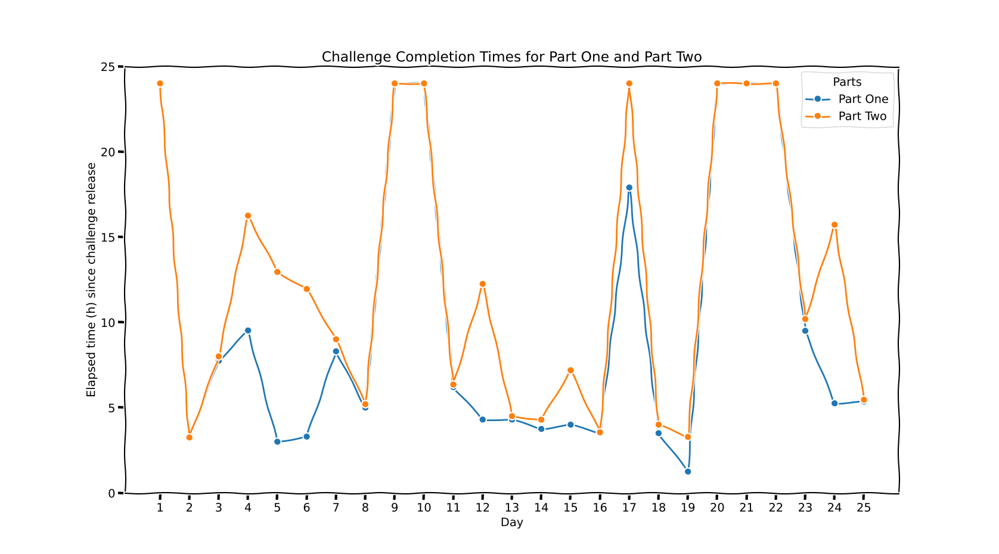
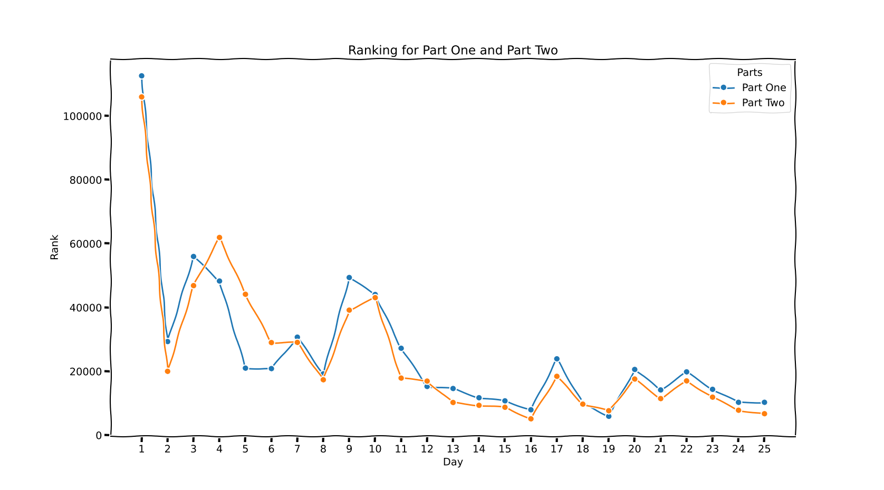
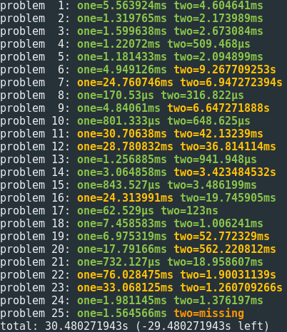
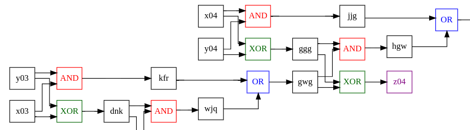

Ah, December. The time of year for hot chocolate, festive lights, and staring at a screen wondering why your code is just not working. Yes, Advent of Code 2024 has come and gone, and it was another glorious (and slightly maddening) season of puzzles, algorithms, and last-minute Googling.

[Advent of Code](https://adventofcode.com/) is the ultimate holiday coding marathon: a December tradition cherished by developers worldwide. Created by [Eric Wastl](https://was.tl/) in 2015, this year marks the 10th anniversary of Advent of Code!

Whether you’re a seasoned programmer or just starting out, AoC has challenges for everyone. It’s the perfect opportunity to flex your algorithmic muscles, pick up new skills, and maybe confront the harsh truth about your input parsing abilities.

Here’s a look back at what I learned, how I performed, and the moments that made me question all my life choices.

## Stars Earned, Coffee Consumed, Sanity Lost
Let’s kick things off with the highlight: for the first time ever, **I completed all 25 days during the advent period**! This is a big milestone for me, as I usually drop off before reaching the end. While I don’t participate in the leaderboard (feel free to blame kids, time zones, LLMs, or my already busy life), I’m genuinely proud of how I handled it this year.



I took several "days off" (with the challenge being completed at least 24 hours later) but managed to keep up with the Advent rhythm.



Aside from the first challenge, I'm pretty happy with my ranking. My lowest rank is 5069 (day 16, part two), which shows how close (or not) I was to earning points :-)


## My AoC Strategy (Or Lack Thereof)
This year, I went in with a simple plan: solve puzzles, have fun, and avoid spending more than three hours on a single problem. Spoiler alert: I failed on that last one more times than I’d like to admit. Armed with Golang (my trusty accomplice) and a mug of coffee that inevitably turned into cold despair, I set off to tackle the challenges. My typical process went something like this:

1. Read the Puzzle: “Oh, this doesn’t look so bad!”
2. Write the Code: “Wait… what’s this edge case?”
3. Debug the Code: “Oh no, why is my output empty?!”
4. Victory Dance: After far too long, I’d finally submit the correct answer.

## The Highs and Lows

Let’s talk highlights, lowlights, and the “what on earth was that” moments.

### Scanner.Bytes()

Ugh, I totally forgot that `scanner.Bytes()` reuses the same buffer. It's actually a good feature, but it cost me at least an hour to figure it out. With so many 2D grid challenges this year, my initial input parsing routine looked like this:

```go
var grid [][]byte
scanner := bufio.NewScanner(r)
for scanner.Scan() {
    grid = append(grid, scanner.Bytes())
}
```

The obvious issue is that the grid gets messed up because each line is overwritten by the next call to `scanner.Scan()` (since it's the same underlying slice). The fix was simple: just allocate a new `[]byte` slice every time.

```go
var grid [][]byte
scanner := bufio.NewScanner(r)
for scanner.Scan() {
    grid = append(grid, append([]byte{}, scanner.Bytes()...))
}
```

### Strength in Simplicity: Brute Force
As you've probably deduced from my previous articles, I have a bit of a thing for optimization. And, of course, a few crazy folks have taken on the challenge of solving these puzzles in the least possible time. I managed to pull it off for the 2015 edition: every challenge ran in under a second. But this year? Well, I must admit, I gave in to my weaknesses and relied on brute force more times than I'd care to admit. This allowed me to complete all challenges. Don’t worry, though: I swear I’ll go back and optimize those challenges.



It takes about 30 seconds to solve all the challenges. Now, I just need to shave off 29 seconds, totally achievable, right?

### Fastest Solve
And the prize for Fastest Solve goes to... [Day 1: Historian Hysteria](https://adventofcode.com/2024/day/1)! No surprise here, we all need to ease into it, and a simple challenge to kick things off was the perfect warm-up for the AoC season. It was a breeze: just a basic for loop, and *voilà*!

### Biggest Challenge
It might not have been the biggest challenge, but it was definitely the most interesting: [Day 14: Restroom Redoubt](https://adventofcode.com/2024/day/14). Part two involved finding an Easter egg: a Christmas tree should appear on our screen. At first, I was hoping it would show up early, so I tried locating it, but eventually, I threw in the towel. Not knowing where or how big the tree would be, I reused an algorithm from the day before: the flood algorithm. That helped me spot the first time a big enough area was lit up. And guess what? It worked!

### Favorite Puzzle
[Day 24: Crossed Wires](https://adventofcode.com/2024/day/24) is definitely my favorite challenge of the year. Part one was enjoyable, but part two was an absolute blast! Full adder, Half adder, Ripple-carry adder: these terms were all new to me. I had a great time learning about them and ended up solving the challenge by analyzing a visualization and creating heuristics to locate the faulty gates.



## Closing Thoughts and Lessons Learned

Every year, I wonder how to implement this or this algorithm (Dijkstra, DFS, and so on), and every year, I forget. But hey, it's always fun to relearn both new and old things. Last year, I learned about the Shoelace formula and Pick's theorem. This year, I learned the Bron–Kerbosch algorithm to find the largest clique in a graph. Funny enough, we need this kind of algorithm at my company.

I also learned a ton from the Reddit community. Just when you think you've come up with a clever solution, someone swoops in and solves it with a one-liner. And suddenly, you're questioning your entire career choice.

Advent of Code is like a holiday feast for programmers: a mix of fun, a little chaos, and sometimes leaving you in a bit of a code coma. But honestly, I wouldn’t trade it for anything. Whether I was chuckling at a brilliant solution or groaning at my math skills, it was all part of the journey.

I've got a plan for the next few months: tackle challenges from other years, optimize my solutions to run in under a second, and experiment with new languages like Python and Rust.

To everyone who participated: congrats! Again, many thanks to [Eric Wastl](https://was.tl/)! Here’s to another year of coding, learning, and late-night debugging. See you in 2025!

