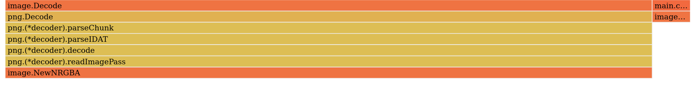
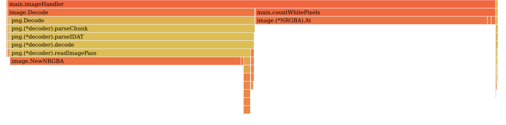
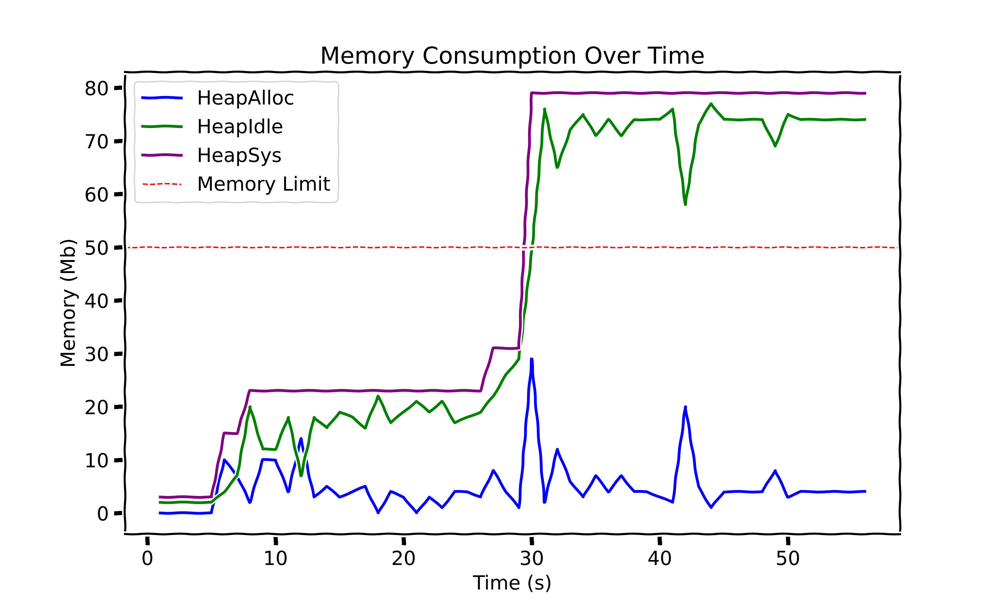

## Introduction

Cyberattacks are highly opportunistic, exploiting any available vector to infiltrate and deliver their threats. One surprising attack surface? Images. Malicious actors often craft images specifically designed to slip past security solutions, knowing that processing them can be resource-intensive. Several years ago, at Vade, I began working on Computer Vision components to combat this, developing tools capable of detecting threats hidden in images. One such tool was RIANA, which at its peak was blocking up to [500 million spam emails over a 90-day period](https://www.vadesecure.com/en/blog/an-update-on-logo-detection-technology).

As with much of our work at Vade, these components are developed in Go, and along the way, we noticed a recurring problem: our image-handling services were regularly crashing due to high memory consumption. In this article, I’ll walk you through the reasons behind these crashes, how we diagnosed them, and the solutions we implemented to keep things running smoothly (and prevent our services from taking unplanned naps).

## A Practical Example

To demonstrate the analysis, let’s start with a minimal service that processes images and counts the number of white pixels. This service exposes an endpoint, accepting images via the body of POST requests and returning the result as a JSON-encoded response. For the sake of keeping this blog post focused and straightforward, we’ll skip over error handling.

```go
package main

import (
	"encoding/json"
	"image"
	"image/color"
	"net/http"
	"log"

    _ "image/png"
    _ "image/jpeg"
)

type PixelCountResponse struct {
	WhitePixelCount int `json:"white_pixel_count"`
}

func countWhitePixels(img image.Image) int {
	white := color.RGBA{255, 255, 255, 255}
    var count int

	// Iterate over each pixel in the image
	for x := 0; x < img.Bounds().Dx(); x++ {
		for y := 0; y < img.Bounds().Dy(); y++ {
			if img.At(x, y) == white {
				count++
			}
		}
	}
	return count
}

func imageHandler(w http.ResponseWriter, r *http.Request) {
	// Decode the image from the request body
	img, _, err := image.Decode(r.Body)
	if err != nil {
        // Error handling
	}

	response := PixelCountResponse{
		WhitePixelCount: countWhitePixels(img),
	}

	// Return JSON response
	w.Header().Set("Content-Type", "application/json")
	json.NewEncoder(w).Encode(response)
}

func main() {
	http.HandleFunc("/count-white-pixels", imageHandler)
	http.ListenAndServe(":8080", nil)
}
```

For our example, we’ll package the application into a Docker image and use Docker to set memory limits on the container. This way, we can control the memory usage more effectively and avoid any unexpected surprises.

```dockerfile
FROM gcr.io/distroless/base
COPY image-app /
EXPOSE 8080
ENTRYPOINT [ "/image-app" ]
```

Using the Dockerfile above, we can build the docker image and run it with memory limits:

```bash
docker build -t image-app .
docker run --rm -p 8080:8080 --memory="50m" --memory-swap="50m" image-app
```

The `--memory` flag lets us specify the maximum amount of memory the container can use. The `--memory-swap` flag ensures no swap is used by setting the total limit for memory and swap combined. When both flags are set to the same value, it effectively disables swap for the container. In this example, the container is restricted to 50 MiB of memory.

Now, using a local corpus of images, we can send images to our application, using HTTPie:

```bash
for f in *png; do 
    http POST http://localhost:8080/count-white-pixels < $f; 
done
```

Everything works smoothly, until... the Docker container unexpectedly stops (much to our surprise). What’s going on? Let’s dive into that in the next section.


## OOM Kill analysis

Your application is deployed and running smoothly, until you get an alert from your deployment service, such as Kubernetes. Your app has crashed. Again. And again. Wait, all it does is count white pixels, what could possibly go wrong? The alert points to an OOM Kill (Out of Memory), so it’s clear the issue is with memory. Time to investigate.

Go offers several powerful tools for analyzing your program’s performance. A great place to start is with pprof, which provides profiling data by simply adding one line to your code:

```go
import _ "net/http/pprof"
```

This enables profiling endpoints with minimal overhead, making it safe to use even in a production environment. While your application is running and processing images, you can look at its heap profile:

```bash
go tool pprof -http :8081 http://localhost:8080/debug/pprof/heap
```

This will open a tab in your browser where you can explore the application's memory usage through various viewers and samples. Let’s start by examining the flame graph for the `inuse_space` sample, which shows the amount of memory that’s allocated and not yet released (at the time of the command).



No surprises here in terms of memory usage: most of the allocated memory is consumed by the decoded image. The total memory usage isn’t excessive, but it varies depending on the size of the image being processed. However, we can observe a small portion of memory (on the far right) associated with the `image.At` function, which is responsible for retrieving each pixel in the `countWhitePixels` function.

Now, let’s examine the `alloc_space` sample, which displays the total amount of memory allocated since the application started.



Here’s the first surprise! The total memory allocated since the application started is split almost evenly between `image.Decode` and `image.At`, each consuming around 300 MB. I didn’t expect `image.At` to use that much memory, but considering it copies each pixel (4 `uint8` values per pixel), it makes sense. This could be easily avoided by manipulating the underlying array of `uint8` instead of calling `image.At`. However, this still doesn't explain why the application exceeded its memory limit at one point and was terminated.


Let’s keep an eye on its memory usage by logging the memory consumption every second.

```go
func bToMb(b uint64) uint64 {
	return b / 1024 / 1024
}

func main() {
    go func() {
        ticker := time.NewTicker(time.Second)
        for range ticker.C {
            var m runtime.MemStats
            runtime.ReadMemStats(&m)
            fmt.Printf("HeapAlloc = %v MiB", bToMb(m.HeapAlloc))
            fmt.Printf("\tHeapIdle = %v MiB", bToMb(m.HeapIdle))
            fmt.Printf("\tHeapSys = %v MiB\n", bToMb(m.HeapSys))
        }
    }()

    // [...]
}
```

This will print at regular interval the memory consumption:

```
[...]
HeapAlloc = 10 MiB	HeapIdle = 4 MiB	HeapSys = 15 MiB
HeapAlloc = 3 MiB	HeapIdle = 11 MiB	HeapSys = 15 MiB
HeapAlloc = 8 MiB	HeapIdle = 6 MiB	HeapSys = 15 MiB
HeapAlloc = 8 MiB	HeapIdle = 6 MiB	HeapSys = 15 MiB
HeapAlloc = 10 MiB	HeapIdle = 12 MiB	HeapSys = 23 MiB
HeapAlloc = 10 MiB	HeapIdle = 12 MiB	HeapSys = 23 MiB
[...]
```

Here is a graph representing the memory consumption, with our application without memory limit:



The graph shows memory usage over time, with `HeapSys` representing the application's overall memory footprint. You can think of `HeapSys` as nearly the sum of `HeapAlloc` and `HeapIdle`: `HeapAlloc` is the actual memory in use by the application, while `HeapIdle` is memory that Go has either reserved for future allocations or not yet reclaimed by the OS. This helps us see how much memory is actively in use versus reserved but idle.

Our application would have crashed around the 30-second mark if a memory limit had been enforced. But what exactly is happening here? You’ll notice a significant gap between `HeapAlloc` (the memory actively used by the application) and `HeapSys` (the total heap memory footprint). Like Java, Go relies on a garbage collector, which periodically frees up unused memory. However, even after memory is released, it doesn’t necessarily return to the OS immediately. Instead, the application may hold onto that idle memory for future allocations. When large allocations occur, the application may request additional memory from the OS, as seen around the 30-second mark. Even after this `HeapAlloc` peak, the total memory allocated isn’t immediately reclaimed by the OS. This can happen because Go, unaware of deployment-imposed memory limits, might hold onto memory for potential future use, or simply because the OS doesn’t currently need that memory back. This poses a clear problem for our application, given the memory constraints we set earlier.

The next section will cover solutions for building a more resilient application (one that uses memory more efficiently and is aware of its deployment environment) to help prevent out-of-memory kills.

## Solutions

### Avoid memory allocations

Our analysis revealed that `image.At`, which retrieves the pixel at a specific location, creates additional allocations - even though the raw decoded image is already stored in memory. We can prevent these allocations by working directly with the raw decoded image. However, because `image.Image` is an interface, we can’t directly access the underlying data and need to type cast to the specific structure. The following code handles the two most commonly used structures (at least for our test dataset): `image.NRGBA` and `image.RGBA`.

```go
func countWhitePixels(img image.Image) (int, error) {
	switch v := img.(type) {
	case *image.NRGBA:
		return countWhitePixelsFromRGBA(v.Pix, v.Stride), nil
	case *image.RGBA:
		return countWhitePixelsFromRGBA(v.Pix, v.Stride), nil
	default:
		return 0, fmt.Errorf("unsupported image type %T", img)
	}
}

func countWhitePixelsFromRGBA(pix []uint8, stride int) int {
	var count int
	for offset := 0; offset < len(pix); offset += stride {
		if pix[0] == 255 && pix[1] == 255 &&
            pix[2] == 255 && pix[3] == 255 {
			count++
		}
	}
	return count
}
```

This approach would need to be extended to accommodate other image types, such as `image.Paletted` or `image.YCbCr`, which have different underlying structures.


### Filtering images

Do we really need to handle 4K images? Probably not. For an `image.RGBA` instance, a decoded image roughly occupies `width*height*4` bytes in memory. For example, a 1920x1080 image requires about 8 MiB. Handling a single image might be feasible, but our service processes multiple images in parallel. Given our experimental 50 MiB memory limit, this could easily be exceeded. Our next improvement, therefore, is to filter images before decoding.

The Go standard library provides just what we need: `image.DecodeConfig`. This function doesn’t fully decode the image but instead reads only the color model and dimensions. With this, we can ensure images aren’t too large before proceeding.

```go
func decodeImage(r io.Reader) (image.Image, error) {
    // Use a TeeReader to read the image header and 
    // store the read bytes in a buffer.
    var headerBuffer bytes.Buffer
    teeReader := io.TeeReader(r, &headerBuffer)

    // Get the dimensions of the image
    config, _, err := image.DecodeConfig(teeReader)
    if err != nil {
        return nil, err
    }

    // Check the maximum size (arbitrary size)
    if config.Width*config.Height >= 1000*1000 {
        return nil, errors.New("image too big")
    }

    // Concatenate the buffered header and the remaining image.
    fullReader := io.MultiReader(&headerBuffer, r)

    // Now, fully decode the image
    img, _, err := image.Decode(fullReader)
    return img, err
}
```

In addition to filtering and allocation optimizations, we can also guide Go to better understand its deployment environment. We'll explore how in the next section.

### Helping Go understand its environment

Does Go automatically know we've capped its memory at 50 MiB? Not exactly, as its memory usage leads to frequent crashes. Without awareness of the limit, Go makes conservative decisions, like reserving memory for future allocations. To address this, [Go 1.19](https://tip.golang.org/doc/go1.19) introduced `GOMEMLIMIT`, that sets the maximum on the total amount that the Go runtime can use. While this may sound like a magic fix, it's not. I'll first explain how it works and then highlight why you should be cautious when using `GOMEMLIMIT`.

Using this feature is straightforward: you can set it with the `GOMEMLIMIT` environment variable or the `debug.SetMemoryLimit` function. This is a soft limit, meaning your application might exceed it if necessary. However, when the limit is reached, the garbage collector will kick in to keep memory usage as close to the limit as possible, helping your application stay within its memory boundaries whenever feasible. I highly recommend reading the official documentation, [A Guide to the Go Garbage Collector (Memory Limit)](https://tip.golang.org/doc/gc-guide#Memory_limit), which includes excellent interactive graphs. Also, check out the talk [Respecting Memory Limits in Go](https://opensourcelive.withgoogle.com/events/go-day-2022/watch?talk=talk4) for further insights.

As recommended in the official documentation, it’s best to leave a bit of headroom when setting `GOMEMLIMIT` (around 5-10%). For our case, we’ll set a memory limit of 45 MiB and apply all previous optimizations to see how it performs.

")

Our application is no longer being killed, hooray! However, you might argue that I "cheated" by discarding some images. In a constrained environment like ours, tough decisions need to be made - one of which is filtering out certain inputs.

So, have we solved the problem and saved our application from constant restarts? Unfortunately, no. As I mentioned earlier, GOMEMLIMIT sets a soft memory limit, meaning you can't guarantee that your application won't exceed its allocated memory. Even worse, if the application requires more memory than available, it can enter a **trashing** state, where the program becomes largely unresponsive as the garbage collector continuously struggles to free up memory. Let's not end on a negative note, though! This approach will definitely help reduce the number of OOM kills.

## Conclusion

In the world of high-performance, memory management isn't just a technical challenge, it's a critical operational concern. Our image processing service had a seemingly simple task: counting white pixels in images. Yet, this straightforward operation revealed complex memory dynamics in Go applications.

The core problem was multifaceted: Go's garbage collector doesn't automatically optimize for deployment-specific memory constraints, image processing inherently requires significant memory allocations, and standard library functions like `image.At` create unexpected memory overhead. These challenges can lead to unpredictable application behavior, including frequent Out of Memory (OOM) kills that disrupt service reliability.

Our solution represents progress, consisting of a strategic combination of techniques:

- Direct manipulation of image pixel data to reduce allocations.
- Filtering images based on size before full decoding.
- Leveraging Go's `GOMEMLIMIT` to guide runtime memory management

However, our current solution, while promising, has a critical limitation we've yet to address: concurrency. In a real-world scenario where millions of acceptable images might be processed simultaneously, our existing approach would still be vulnerable to memory exhaustion. Even with image filtering and memory limit optimizations, concurrent processing could quickly overwhelm our 50 MiB memory constraint.

This reveals our next critical challenge: implementing robust throttling mechanisms, such as limiting the number of concurrent images processed simultaneously, implementing a queue with backpressure, or adjusting processing rates based on available system resources. I've already explored one of these solutions in my previous article [Taming the Flow: Throttling in Golang with Semaphore Magic](). Check it out for more details.

The key takeaway? In constrained environments, understanding your runtime's memory behavior isn't optional, it's essential for building robust, efficient services.

## Recommended related reading

- [A Guide to the Go Garbage Collector / Memory limit](https://tip.golang.org/doc/gc-guide#Memory_limit).
- [Go Day 2022: Respecting Memory Limits in Go](https://opensourcelive.withgoogle.com/events/go-day-2022/watch?talk=talk4) by Michael Knyszek.
- [GOMEMLIMIT is a game changer for high-memory applications](https://weaviate.io/blog/gomemlimit-a-game-changer-for-high-memory-applications) by [Etienne Dilocker](https://github.com/etiennedi).
- [Go Beyond: Building Performant and Reliable Golang Applications](https://blog.zomato.com/go-beyond-building-performant-and-reliable-golang-applications) by Sakib Malik.


