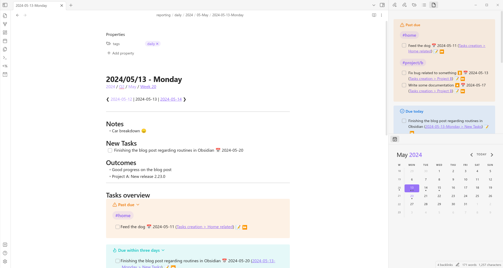
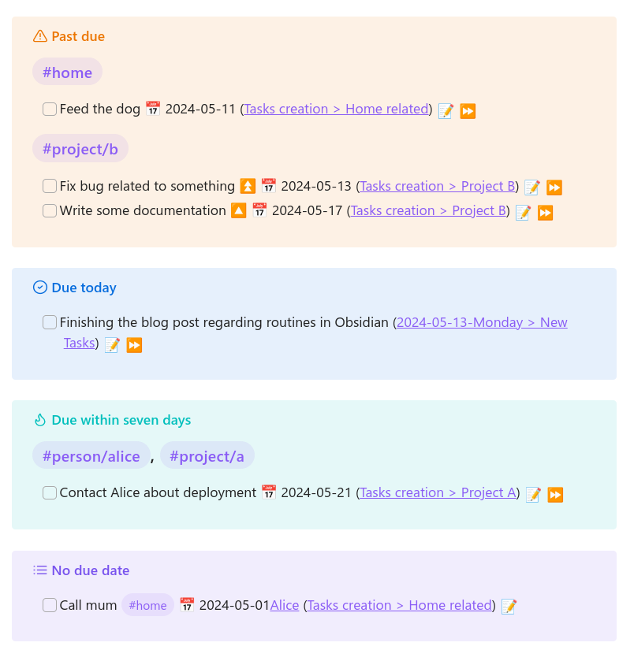
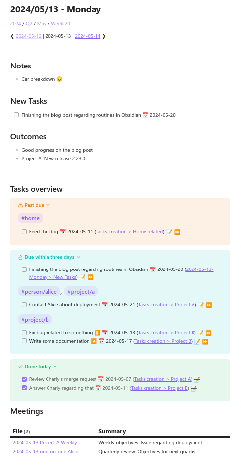
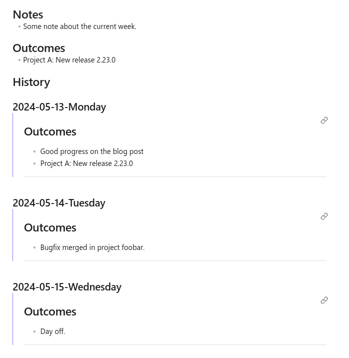
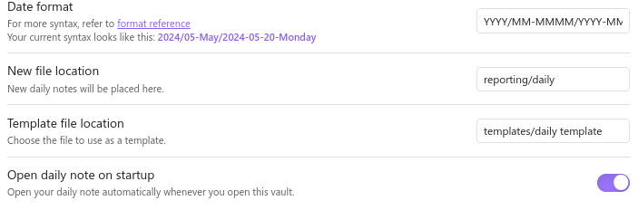
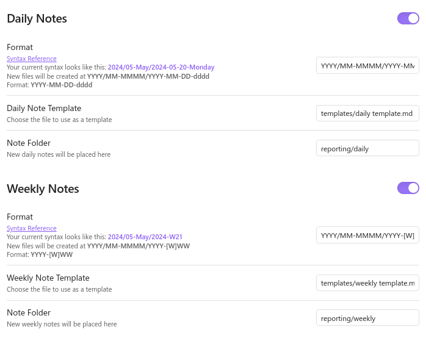
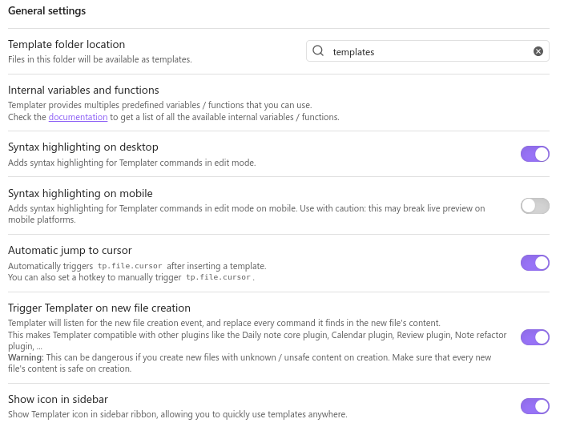
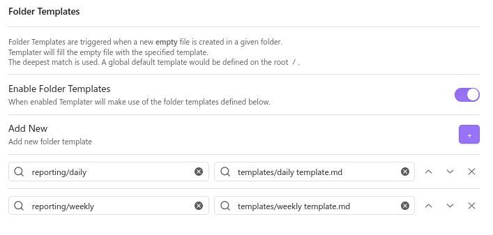
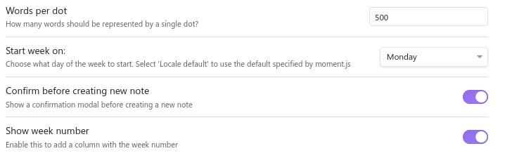

As the number of responsibilities increases, the importance of establishing effective routines becomes evident, whether in professional or personal settings. You may have encountered instances in meetings where individuals commit to certain actions but fail to follow through due to a lack of note-taking or ineffective task prioritization. I have myself experienced that in the beginning of my career and continue to observe it among my junior colleagues.

Wanting to keep my commitments, I turned to note-taking apps a while back. Switching to Obsidian last year was a big move for me, and I'm still thrilled about it. Even though it's free but not open-source, Obsidian comes with great performance and a bunch of features out of the box. Plus, the community plugins really step up its game for handling day-to-day tasks, whether work related or not.



This series of articles presents how I leverage Obsidian in my professional life. This article focuses on implementing daily and weekly routines aimed at addressing key questions such as:

- What tasks need to be prioritized today?
- What deadlines do I need to meet, and what expectations do others have of me?
- What progress have I made today and over the past week?
- What reports or updates do I need to provide to my superiors on a regular basis?

## Task management

I have a `Task dashboard` note tracking the tasks by priority, providing me an overview of everything I need to address. This note is typically displayed in one of Obsidian's side panes. The template of this dashboard can be found in the [Templates](#templates) section of this article.



The [tasks](https://publish.obsidian.md/tasks/Introduction) community plugin is the central piece for my task management. It allows me to track tasks across my Obsidian vault and offers numerous features. These include advanced query language capabilities and the ability to add additional information to tasks, such as due dates, priorities, repetitions, and reminders. Furthermore, I can conveniently create or mark tasks as completed from any location within my vault.

I employ two methods for creating tasks:

1. If a task is related to a meeting, the new task is created within the associated meeting note (further discussed in an upcoming article). This approach provides additional context that may be useful when I address the task later.
2. If the task is not linked to any specific context, I create it directly within my daily note.

Creating a task is straightforward. Simply follow this syntax:

```
- [ ] First task
- [ ] Second task
```

The plugin proposes to add valuable details, such as the due date or the priority. You can also summon the plugin modal by pressing `Control + P` and selecting `Tasks: Create or edit`. To ease the creation of tasks in the daily note wherever you are (even if the daily note is not yet created), you can create a [QuickAdd](https://publish.obsidian.md/quickadd/index) custom command [^QuickAddDaily].

Tasks can have tags, just by adding `#my-tag` anywhere in the text description of the task. I use the tags mainly to categorize the topic and the associated person. This let me have a list of tasks associated only to a project or a person (discussed in an upcoming article). Here is an example:

```
- [ ] Write documentation regarding feature foobar #project/fizzbuzz
- [ ] Review Alice's merge request #project/fizzbuzz #person/Alice
- [ ] Prepare Alice's yearly interview #person/Alice
```

[^QuickAddDaily]: https://publish.obsidian.md/tasks/Advanced/Tasks+Api#Create+the+QuickAdd+Capture

## Daily routine

The goal of my daily routine is efficiency. I've made it a habit to start my day by reviewing my daily note, planning my tasks, and ensuring that I meet my expectations. Similarly, just before logging off in the evening, I check my daily note one last time to ensure that all notes are complete. Most importantly, I summarize my day into short items.




The **Notes** section contains any general note related to that day. The same applies to the **New Tasks** section, where I include tasks not related to any meetings scheduled for the day. The **Outcomes** section is important, since it will be integrated automatically into the weekly template. Then, the **Task Overview** section is a shorter version of the Task Dashboard note, which displays overdue tasks, tasks that need to be done shortly, and the tasks finished that day. Finally, the **Meetings** section lists the meetings held on this specific day, while the **Notes** section lists any modified notes.

At the end of each day, I review my daily note and summarize the main items of the day in the Outcomes section. While completing the outcomes of the day, I also make sure that all the created/modified notes of the day do not miss information, such as tags, related notes, and so on.

The template of this daily note can be found in the [Templates](#templates) section of this article.

## Weekly routine

The weekly routine is primarily for my hierarchy, rather than for my personal use. Indeed, since I make a weekly report, I needed an easy way to compile the main outcomes of the current week. This is done by integrating the **Outcomes** section of the daily notes of the week. I do not need it, but you could even build monthly, quarterly, and yearly notes with the same approach.



The template of this weekly note can be found in the [Templates](#templates) section of this article.

## Implementation

In this section, I present how to setup Obsidian to implement these routines.

### Plugins

Here are the plugins used throughout the task management and daily/weekly notes:

- [Tasks](https://publish.obsidian.md/tasks/Introduction) for the task management across your vault.
- [Daily Notes](https://help.obsidian.md/Plugins/Daily+notes) (core plugin) to set up where the daily notes are located, the template location, and to open the daily note on startup.
- [Periodic notes](https://github.com/liamcain/obsidian-periodic-notes) to expand the previous plugin to weekly notes.
- [Templater](https://silentvoid13.github.io/Templater/) to create daily notes from a template.
- [Calendar](https://github.com/liamcain/obsidian-calendar-plugin) to display a calendar that lets you go to any daily or weekly note (and create it if necessary).
- [Dataview](https://blacksmithgu.github.io/obsidian-dataview/) to create SQL-like queries in your notes.
- [Natural Language Dates](https://github.com/argenos/nldates-obsidian) to add relative dates easily (e.g., "in two weeks" or "tomorrow").
- [QuickAdd](https://quickadd.obsidian.guide/docs/) to create custom commands.

To install them, go to Obsidian’s settings, enable the core plugins, then enable the community plugins and search for each plugin mentioned above. Do not forget to enable them!

### Configuration

**Daily Notes**



In my vault, daily notes are located in `reporting/daily` and use the following date format: `YYYY/MM-MMMM/YYYY-MM-DD-dddd`. Feel free to tinker with the date format to match your ideal organization.

**Periodic notes**



Use the same values as for the daily notes. For the weekly notes, they are located in `reporting/weekly` and use the following date format: `YYYY/MM-MMMM/YYYY-[W]WW`.

**Templater**



The most important part of Templater configuration is to enable `Trigger Templater on new file creation`. With this enabled, when you click on your calendar on a day without a daily note, it will create and automatically fill it.



You also want to configure which template to expand based on the note location.

**Calendar**



**QuickAdd**

I use QuickAdd for two reasons in my daily workflow:

1. Add entries in the "Notes" section.
2. Add tasks in the "New Tasks" section.

This is quite helpful, since I can execute these custom commands wherever in my vault, even if my daily note is not created or opened.

Follow these guides to set up these commands (make sure to match the date format and locations):

* [QuickAdd: Capture: Add journal entry](https://quickadd.obsidian.guide/docs/Examples/Capture_AddJournalEntry)
* [Tasks: Capture a new task in the daily note](https://publish.obsidian.md/tasks/Advanced/Tasks+Api#Create+the+QuickAdd+Capture)

### Templates

To import the templates, view the raw version and copy paste them into your vault.



## Conclusion
In conclusion, using Obsidian for managing your daily and weekly routines offers numerous benefits. It's a flexible and powerful tool to keep you organized, manage tasks, and take detailed notes. Don’t be afraid to play around with different plugins and setups to find what works best for you. With regular use, you'll likely see a boost in productivity, better organization, and an overall improvement in your well-being. Give Obsidian a try and see how it can make managing your routines easier and more effective.

## See also

- [Tasks Documentation](https://publish.obsidian.md/tasks/Introduction)
- [QuickAdd Documentation](https://quickadd.obsidian.guide/docs/)
- [Dann Berg: My Obsidian Daily Note Template](https://dannb.org/blog/2022/obsidian-daily-note-template/)
- [Jacob Weidokal: My Obsidian Daily Note Template](https://www.linkedin.com/pulse/my-obsidian-daily-note-template-jacob-weidokal-ytrxc/)
- [Kevin Quinn: Get Started With Obsidian Periodic Notes and Templater](https://kevinquinn.fun/blog/get-started-with-obsidian-periodic-notes-and-templater/)
