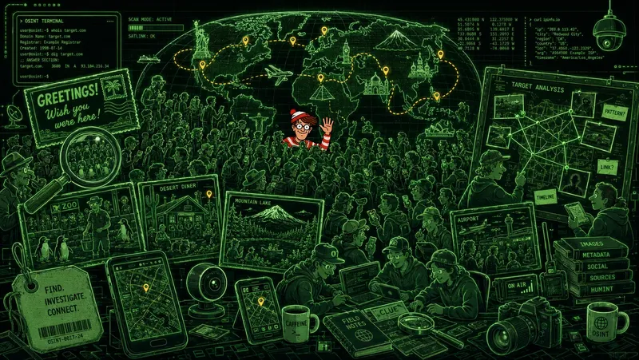
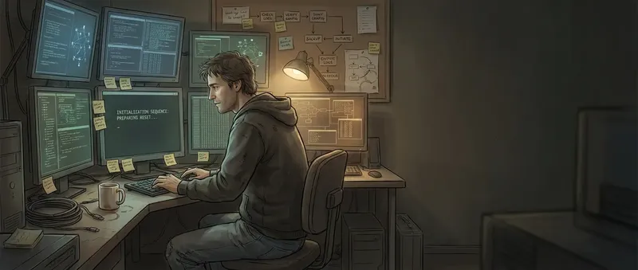
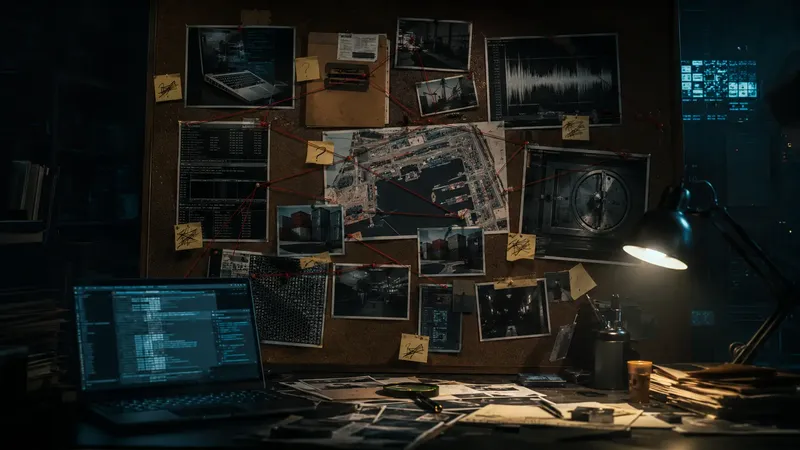

I'm thrilled to share something I've been building with two colleagues: **[Tricky Bits](https://trickybits.dev)** is live. It's a growing set of puzzles that fight back: no fluff, just the tricky bits, solved right in your browser. The motto says it best: *crack the stack*.

## Where it came from

Tricky Bits started life as an internal coding challenge at **[Hornetsecurity](https://www.hornetsecurity.com/)**. We'd run an edition every so often, and people kept asking to share them more widely. June 2026 marked the **5th edition**, and this time, instead of keeping the fun behind the firewall, we built a public site so anyone can play. I put it together with [Gabriel Loiseau](https://gabrielloiseau.github.io/) and [Antoine Honoré](https://www.linkedin.com/in/antoine-honor%C3%A9-78a08611/), who are as much to thank for this as I am.

## How it works

Tricky Bits is organized into **campaigns**: themed, multi-stage puzzles wrapped in a little narrative, rated from 1 to 5 in difficulty. You progress stage by stage, hints are there if you get stuck, and your progress lives in your browser (export, import, or reset it whenever you like).

If the workflow feels familiar, that's no accident: like this very blog, Tricky Bits is built from Markdown and compiled into a static site. The whole thing is open-source, so have a peek at the [builder](https://github.com/tricky-bits/builder) and the [website](https://github.com/tricky-bits/website) if you're curious how it's wired together.

## The campaigns I built

I authored three campaigns for this edition. From gentlest to nastiest:

### [Catch Me If You Scan](https://trickybits.dev/campaigns/catch-me-if-you-scan/) *(2/5, ~36 min)*

A beginner-friendly OSINT chase. Waldo, a globe-trotter, keeps mailing postcards, and everything you need to find him is right there in them. Expect EXIF data, reverse image search, geolocation from landmarks, and a dash of flight tracking. A great place to start.

### [Barry Buffer and the Initialization Sequence](https://trickybits.dev/campaigns/barry-buffer-init/) *(3/5, ~90 min)*

A sysadmin vanished mid-procedure and encoded his monthly system reset across logs and config files. Recover the pieces using ciphers, assorted encodings, a few esoteric languages, and some light forensics. Barry's advice: *read it like a system, not like a sentence.*

### [Barry Buffer and the Cold Boot Case](https://trickybits.dev/campaigns/barry-buffer-coldboot/) *(4/5, ~2h15)*

A noir digital-forensics investigation. A meticulous archivist who encrypts everything has left evidence on a seized laptop, and a protected witness is missing. Crack your way through encryption, steganography, audio ciphers, and metadata to find them before time runs out.

## Go play

That's the pitch. Now go [crack the stack](https://trickybits.dev). If you're new to this kind of thing, start with *Catch Me If You Scan* and work your way up. Have fun, and good luck.
